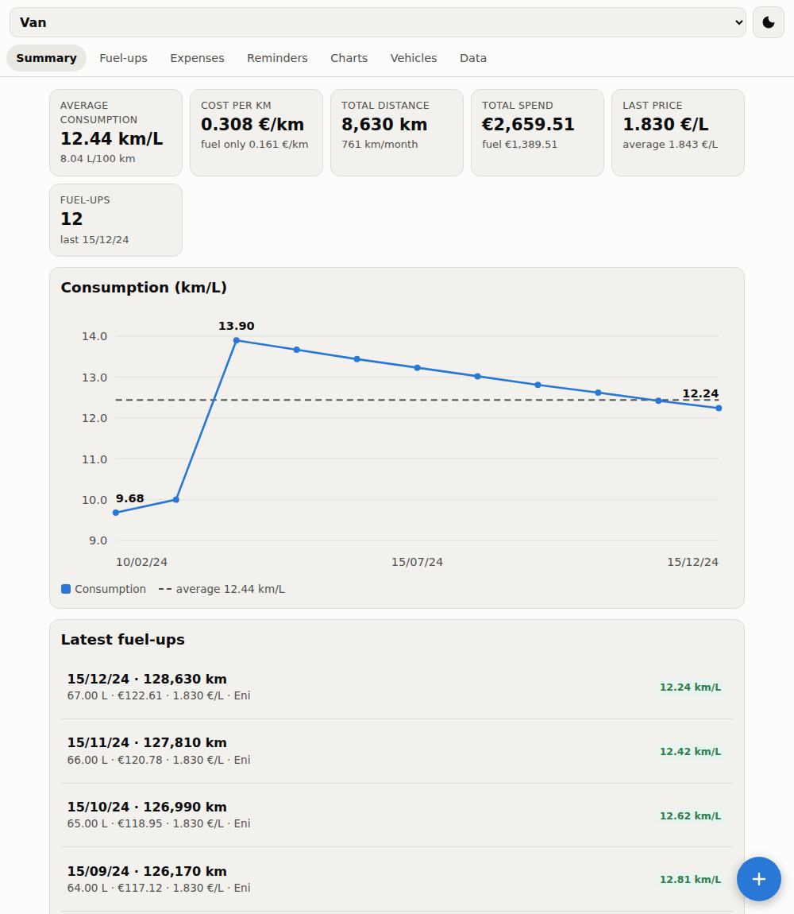
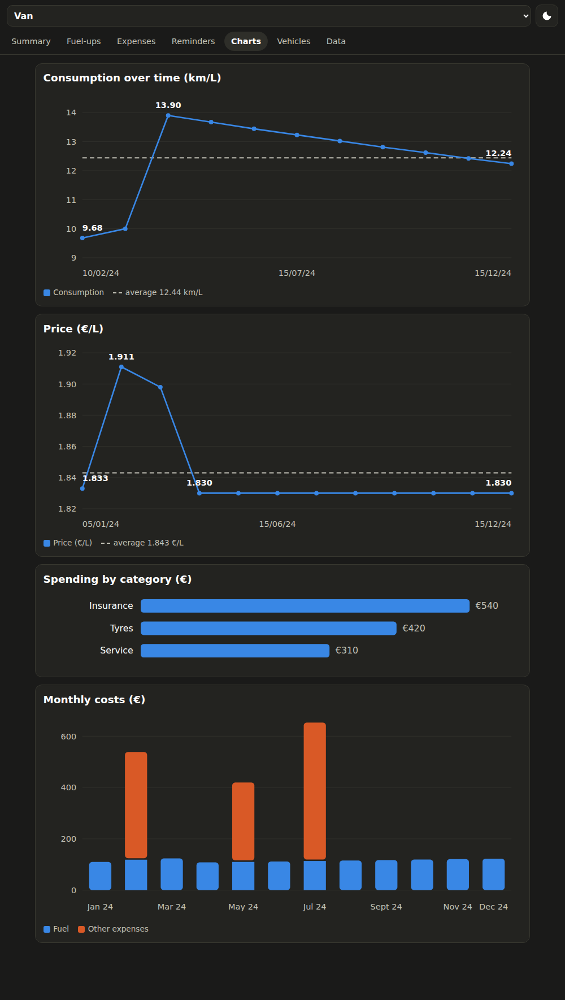
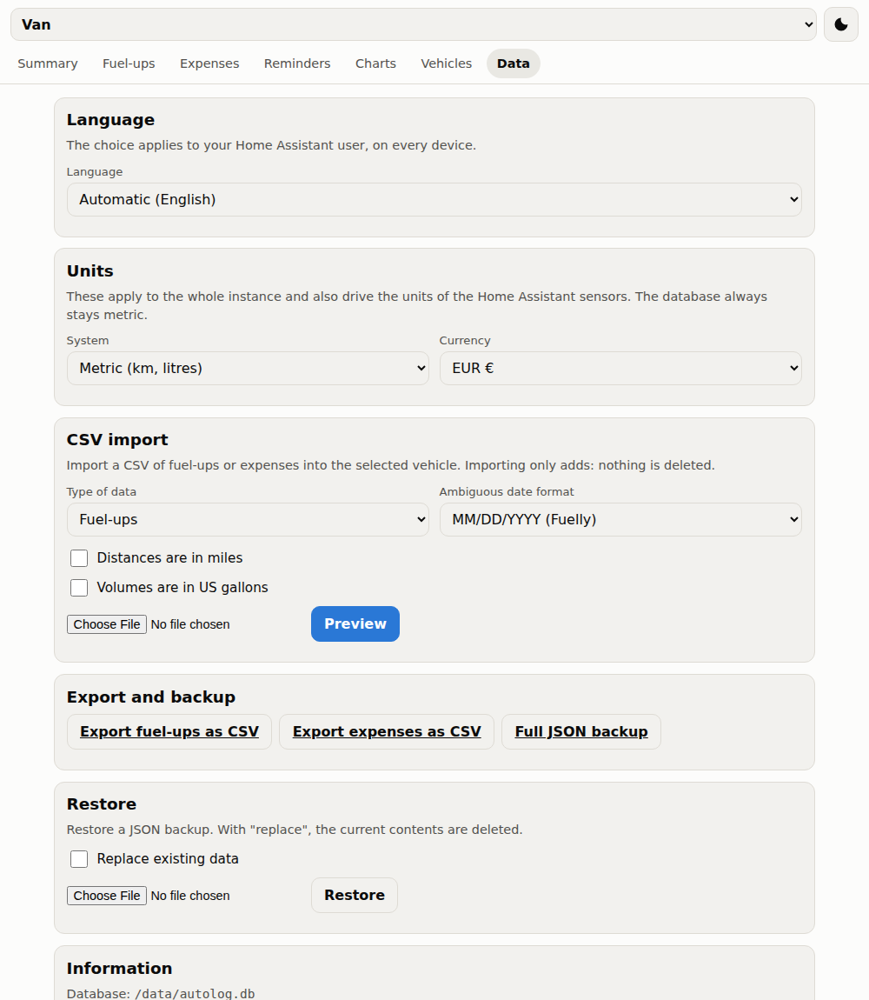

# AutoLog — Home Assistant add-on

[](https://github.com/7hemas7er/autolog-addon/actions/workflows/test.yml)
[](LICENSE)
[](autolog/package.json)

A self-hosted logbook for vehicle fuel-ups, running costs and maintenance,
with every figure exposed to Home Assistant as a proper sensor. A personal
replacement for Fuelly that lives in your own house.



- **Tank-to-tank** fuel economy, in km/L and L/100 km
- Expenses, maintenance and reminders that fall due by date **or** by distance
- Multiple vehicles, each with its own statistics
- Charts for consumption, fuel price, spending by category and monthly costs
- CSV import from **Fuelly** (verified against a real export), plus Fuelio and
  Drivvo column mappings; CSV export and JSON backup
- **One Home Assistant device per vehicle**, with ten long-term-statistics sensors
- Served in the sidebar through Ingress, visible to non-admin users too
- Installable as a PWA on your phone
- **Interface in English and Italian**, picked automatically or by hand

> Metric or imperial, euros or another currency — both are configurable, and
> the database always stays metric so switching never rewrites a record.

<table>
  <tr>
    <td width="50%"></td>
    <td width="50%"></td>
  </tr>
  <tr>
    <td align="center"><em>Charts, dark theme</em></td>
    <td align="center"><em>Language and units</em></td>
  </tr>
</table>

## Installation

1. In Home Assistant go to **Settings → Add-ons → Add-on Store**
2. Open the **⋮** menu, choose **Repositories**, and paste:

   ```
   https://github.com/7hemas7er/autolog-addon
   ```

3. Install **AutoLog** and start it.

If you already run the **Mosquitto** add-on there is nothing to configure: the
broker credentials are requested from the Supervisor at startup. Every option
is documented in [autolog/DOCS.md](autolog/DOCS.md).

## Entities

One device per vehicle, carrying: average consumption (km/L and L/100 km),
cost per kilometre, total distance, total litres, total spend, spend this
month, last price per litre, last fuel-up and next due reminder. Numeric
sensors declare the correct `state_class` and `unit_of_measurement`, so Home
Assistant records long-term statistics for them without any extra setup.

Availability is published on `autolog/status` and backed by an MQTT Last Will,
so if the add-on dies the entities become unavailable instead of silently
holding a stale value.

To log a fuel-up from an automation or an NFC tag on the filler flap:

```yaml
action: mqtt.publish
data:
  topic: autolog/van/cmd/fillup
  payload: '{"odo": 136000, "liters": 45.2, "total_cost": 78.40, "full": 1}'
```

The slug is the vehicle name, lowercased, with every non-alphanumeric character
replaced by `_`. Omit `date` and today is used.

## Language

The interface ships in **English and Italian**. On first load the language is
negotiated from the `Accept-Language` header, so a Home Assistant user browsing
in English gets English without configuring anything.

To override it, go to **Data → Language** and pick one. Behind Ingress the
choice is stored **per Home Assistant user** — the add-on reads the
`X-Remote-User-Id` header the Ingress proxy sets — so two people sharing the
same instance can each use their own language, on every device they log in
from. Outside Ingress the preference is stored once for the instance.

Numbers, dates and month names are formatted through `Intl` in the active
locale, so Italian shows `1.234,50` and `12/03/24` while English shows
`1,234.50`.

Adding a language means copying one block in `autolog/public/i18n.js`,
translating the values and adding the code to the list. A test fails if a key
is missing, left empty, or has placeholders that do not match the other
locales.

Two things stay untranslated on purpose: **category and fuel-type names you
have already saved** are your data, so they keep the wording you typed (only
the suggestion list follows the interface language), and **the MQTT sensor
names in Home Assistant** stay as they are, because renaming them would rename
your entities and break their recorded history.

## Units and currency

Under **Data → Units** you can pick:

- **Metric** — kilometres, litres, km/L (with L/100 km alongside)
- **US customary** — miles, US gallons, MPG
- **Imperial UK** — miles, imperial gallons, MPG

and a currency (EUR, GBP, USD, CHF, SEK, PLN, CZK, DKK, NOK, CAD, AUD).

**The database is always metric**, whatever you pick: kilometres, litres and
raw amounts. Conversion happens only on the way out to the screen and to the
MQTT sensors, and on the way back in from the forms. Switching units therefore
never touches a single stored record, and cannot corrupt your history.

Units are an instance-wide setting, not per user, because they also drive the
unit of the Home Assistant sensors — and two people cannot see the same sensor
in different units. Note that changing them changes those sensor units, which
Home Assistant will notice in its long-term statistics.

## How fuel economy is calculated

Tank-to-tank, the same method Fuelly uses: the distance between two full tanks
divided by the litres put in over that interval. It follows that:

- the **first** full tank never yields a figure — there is nothing to measure from;
- a **partial** fill-up has no figure of its own; its litres roll into the next
  full tank;
- ticking **"previous fuel-up not recorded"** breaks the chain rather than
  producing a fabricated number;
- the **overall average** is distance-weighted (Σ distance / Σ litres), not the
  mean of the individual figures. Getting that wrong is the classic mistake, so
  there is a test for it.

## Design

**Zero npm dependencies, no build step, no external resources** — the app works
with the internet unplugged. Storage is a single SQLite file through Node's
built-in `node:sqlite`. The charts are hand-written SVG and the MQTT client is
implemented from scratch (just the subset of MQTT 3.1.1 that is needed). The
files under `autolog/public/` *are* the artefact: open one, edit it, reload.

The reasoning behind the non-obvious choices is recorded in
[autolog/DECISIONS.md](autolog/DECISIONS.md).

## Tests

```sh
cd autolog && npm test
```

82 tests covering the consumption maths (partial fills, broken chains,
weighted average, non-increasing odometer, division by zero), the CSV parser
(Fuelly in miles and US gallons, Fuelio, Italian CSV, malformed rows), the
JSON export/import round-trip, MQTT packet encoding including packets split
across TCP chunks, and the full publisher flow against a stub broker.

## Scope

Worth knowing before you install it:

- **Units are instance-wide, not per user.** Everyone sharing an instance sees
  the same units, because the Home Assistant sensors can only carry one.
- **It is single-user by design.** Anyone who can reach the Ingress panel sees
  and edits every vehicle. There are no per-person profiles.
- **Architectures: `amd64` and `aarch64`.** The `node:24-alpine` base image is
  not published for armv7, so 32-bit Raspberry Pi installs are not supported.
- **This is a personal project.** It is used daily by its author, but no
  support is promised. Issues and pull requests are welcome; replies may be slow.

## Licence

MIT — see [LICENSE](LICENSE).
